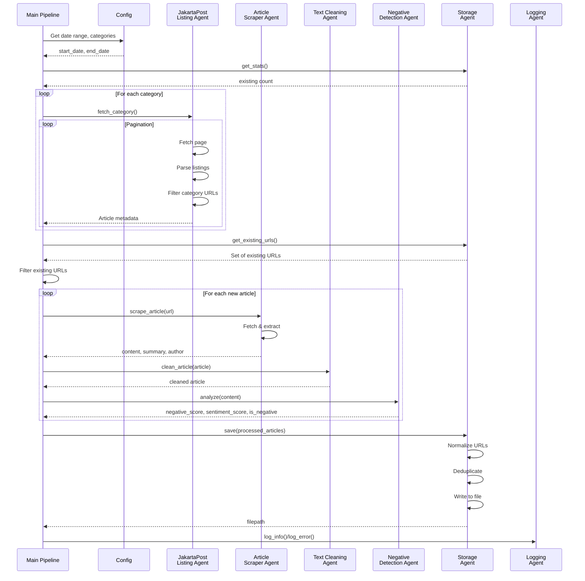
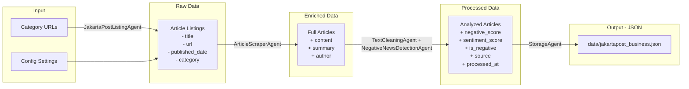
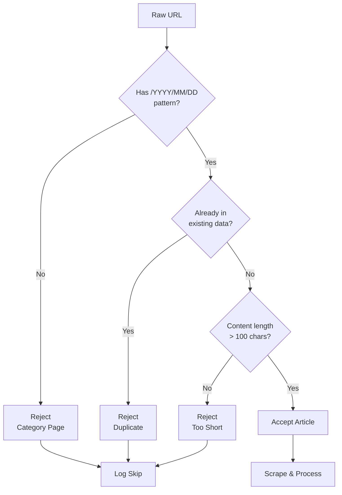
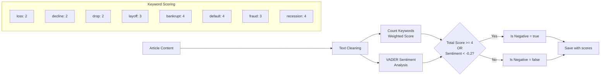
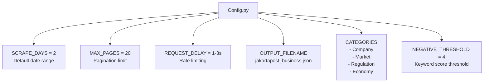

# Jakarta Post Business News Scraper - Flow Process Chart

## Overall Pipeline Flow

```mermaid
flowchart TD
    Start([Start Pipeline]) --> Config[Load Configuration<br/>- Date range<br/>- Categories<br/>- Max pages]
    Config --> Stats[Show Existing Stats<br/>from Storage Agent]
    
    Stats --> Fetch[1. Fetch Listings<br/>JakartaPostListingAgent]
    
    subgraph Listing_Process[Listing Process - Per Category]
        direction TB
        CatPage[Fetch Category Page] --> ParseList[Parse Article Listings]
        ParseList --> FilterCat{Is Article URL?<br/>Has date pattern}
        FilterCat -->|No| SkipCat[Skip Category Page]
        FilterCat -->|Yes| CheckDate{Within Date<br/>Range?}
        CheckDate -->|No| StopCat[Stop Pagination]
        CheckDate -->|Yes| AddList[Add to List]
        AddList --> NextPage{More Pages?}
        NextPage -->|Yes| CatPage
        NextPage -->|No| StopCat
    end
    
    Fetch --> Listing_Process
    Listing_Process --> FilterExist[2. Filter Existing URLs<br/>Skip already scraped articles]
    
    FilterExist --> Scrape[3. Scrape Articles<br/>ArticleScraperAgent]
    
    subgraph Scraping_Process[Scraping Process - Per Article]
        direction TB
        FetchArticle[Fetch Article URL] --> Extract[Extract Content]
        Extract --> CheckAMP{Content Found?}
        CheckAMP -->|No| TryAMP[Try AMP Version]
        CheckAMP -->|Yes| CleanScrape[Clean Content]
        TryAMP --> CleanScrape
        CleanScrape --> MergeData[Merge with Metadata]
    end
    
    Scrape --> Scraping_Process
    Scraping_Process --> Process[4. Process Articles]
    
    subgraph Processing_Process[Processing - Per Article]
        direction TB
        CleanText[Clean Text<br/>TextCleaningAgent] --> CheckLen{Content > 100 chars?}
        CheckLen -->|No| SkipShort[Skip - Too Short]
        CheckLen -->|Yes| Analyze[Analyze Sentiment<br/>NegativeNewsDetectionAgent]
        Analyze --> CalcScore[Calculate:<br/>- Negative Score<br/>- Sentiment Score<br/>- Is Negative?]
    end
    
    Process --> Processing_Process
    Processing_Process --> Save[5. Save Results<br/>StorageAgent]
    
    subgraph Save_Process[Save Process]
        direction TB
        LoadExist[Load Existing Data] --> NormURLs[Normalize All URLs]
        NormURLs --> MergeNew[Merge with New Articles<br/>Deduplicate by URL]
        MergeNew --> SaveFile[Save to JSON File]
    end
    
    Save --> Save_Process
    Save_Process --> Report[Generate Report<br/>- Articles found<br/>- Successfully scraped<br/>- Negative articles<br/>- Total cumulative]
    Report --> End([End Pipeline])
    
    %% Error handling
    Fetch -.->|Error| LogError[Log Error<br/>Continue]
    Scrape -.->|Error| LogError
    Process -.->|Error| LogError
    LogError --> Continue[Continue with<br/>next article]
```



---

## Agent Interactions



---

## Data Flow



---

## URL Filtering Logic



---

## Negative News Detection



---

## File Structure

```
project/
│
├── pipeline.py                 # Main orchestration
├── cleanup_data.py             # Data cleaning utility
│
├── agents/
│   ├── config.py              # Configuration settings
│   ├── jakarta_post_listing.py # Fetch article listings
│   ├── article_scraper.py     # Scrape full articles
│   ├── text_cleaning.py       # Clean text content
│   ├── negative_detection.py  # Sentiment analysis
│   ├── storage.py             # Save/load JSON data
│   └── logging_agent.py       # Error/info logging
│
├── data/
│   └── jakartapost_business.json  # Output data
│
└── logs/                      # Error logs
    └── YYYY-MM-DD_errors.log
```

---

## Configuration



---

## Key Improvements Made

| Issue | Solution |
|-------|----------|
| Category pages scraped | URL pattern filter (`/YYYY/MM/DD/`) |
| Duplicate URLs | Normalization (http→https, www consistency) |
| Re-scraping existing | Pre-filter before scraping step |
| Multiple URL formats | Always normalize to single format |
| Data corruption | Append-only, never overwrite |

---

## Run Commands

```bash
# Run pipeline with default settings (2 days, 20 pages)
python pipeline.py

# Run with custom days
python pipeline.py --days 5

# Run with fewer pages for testing
python pipeline.py --max-pages 2

# Clean existing data (remove duplicates/categories)
python cleanup_data.py
```
